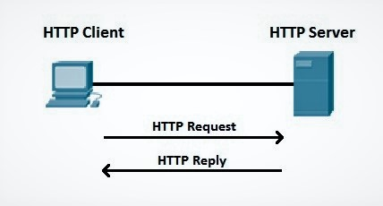
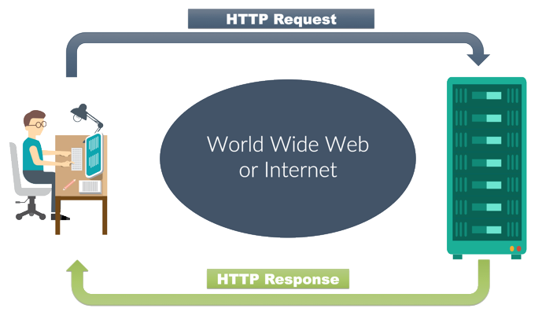

# Descrição

Este aplicativo web consumirá informações de uma API e as exibirá na página.

Essa aplicação se conecta a uma [API do Studio Ghibli]([https://ghibliapi.herokuapp.com/), encontra os dados com o JavaScript 
e exibi no front-end de um site. 

A API do Studio Ghibli cataloga:
* pessoas ( cor dos olhos, cabelo...)
* lugares 
* e coisas encontradas nos mundos do Ghibli. 

Ele foi criado para ajudar os usuários a descobrir recursos, consumi-los por meio de solicitações HTTP e interagir com eles da maneira que fizer sentido.

# Pré-requisitos

Conhecimento básico em:

* HTML
* CSS
* SINTAXES E TIPO DE DADOS JAVASCRIPT
* OBJETOS JSON E JAVASCRIPT

# Overview API

Uma API é um conjunto de métodos de comunicação entre vários componentes de software. Em outras palavras, uma API permite que um software se comunique com outro software.

Vamos focar no conceito de que uma API permite que um servidor web interaja com software de terceiros através de requests HTTP

Vamos focar em GET e POST ou Contexto = Solicitação + Resposta

# Como se comunicam?

Os cabeçalhos HTTP passam mais informações entre o cliente e o servidor por meio dos cabeçalhos de solicitação e resposta. Os cabeçalhos não diferenciam maiusculas e minusculas e sao separados por dois pontos (:) 

Neste cabeçalho, contem informações:

* Content-Type:text/html
* Date
* Server 
* Accept-Econding 
* Accept-Language

Essas informações é possível você analisar em qualquer página WEB > Inspect the page > Network > Seleciona a requisição > Headers.

A rolar a barra de rolagem, é possível verificar: 
General > Response Headers > Request Headers

Assim, o servidor Web está usando requests HTTP para se comunicar com um endereço URL ou endpoint disponível na internet contendo dados em JSON.

Uma API web usa requests HTTP que correspondem aos verbos CRUD.

Açao          |	Método HTTP	 | Descrição
------        |--------------|------------
Criar/Create  | POST |Cria um novo recurso
Ler / Read	  | GET  | Recupera um recurso
Atualizar/Update |	PUT/PATCH	| Atualiza um recurso existente
Excluir/Delete	 | DELETE  |	Exclui um recurso

# Como Conectar ao API do Studio Ghibli?

As solicitações (os GETs) são feitas com o comando `curl`

~~~
`curl https://ghibliapi.herokuapp.com/films/58611129-2dbc-4a81-a72f-77ddfc1b1b49`

~~~

Este comando retornará uma resposta NO FORMATO JSON (os POSTs)

~~~
{
"id": "58611129-2dbc-4a81-a72f-77ddfc1b1b49",
"title": "My Neighbor Totoro",
"original_title": "となりのトトロ",
"original_title_romanised": "Tonari no Totoro",
"description": "Two sisters move to the country with their father in order to~ be closer to their hospitalized mother, and discover the surrounding trees are inhabited by Totoros, magical spirits of the forest. When the youngest runs away from home, the older sister seeks help from the spirits to find her.",
"director": "Hayao Miyazaki",
"producer": "Hayao Miyazaki",
"release_date": "1988",
"running_time": "86",
"rt_score": "93",
...
}
~~~

# Get endpoint

Vamos até a sessão de filmes na documentaçao [API do Studio Ghibli]([https://ghibliapi.herokuapp.com/).

A direita, temos o GET/Films com a URL do endpoint da API. Esse link exibirá um array em JSON

[Array do JSON]([https://ghibliapi.herokuapp.com/films)

~~~
  {
    "id": "2baf70d1-42bb-4437-b551-e5fed5a87abe",
    "title": "Castelo no Céu",
    "original_title": "天空の城ラピュタ",
    "original_title_romanised": "Tenkū no shiro Rapyuta",
    "image": "https://image.tmdb.org/t/p/w600_and_h900_bestv2/npOnzAbLh6VOIu3naU5QaEcTepo.jpg",
    "movie_banner": "https://image.tmdb.org/t/p/w533_and_h300_bestv2/3cyjYtLWCBE1uvWINHFsFnE8LUK.jpg",
    "description": "A órfã Sheeta herdou um cristal misterioso que a liga ao mítico reino do céu de Laputa. Com a ajuda do engenhoso Pazu e um bando de piratas do céu, ela segue para as ruínas do outrora grande Sheeta e Pazu devem enganar o malvado Muska, que planeja usar a ciência de Laputa para se tornar o governante do mundo.",
    "diretor": "Hayao Miyazaki",
    "produtor": "Isao Takahata",
    "data_lançamento": "1986",
    "running_time": "124",
    "rt_score": "95",
    "pessoas": [
      "https://ghibliapi.herokuapp.com/people/598f7048-74ff-41e0-92ef-87dc1ad980a9",
      "https://ghibliapi.herokuapp.com/people/fe93adf2-2f3a-4ec4-9f68-5422f1b87c01",
      "https://ghibliapi.herokuapp.com/people/3bc0b41e-3569-4d20-ae73-2da329bf0786",
      "https://ghibliapi.herokuapp.com/people/40c005ce-3725-4f15-8409-3e1b1b14b583",
      "https://ghibliapi.herokuapp.com/people/5c83c12a-62d5-4e92-8672-33ac76ae1fa0",
      "https://ghibliapi.herokuapp.com/people/e08880d0-6938-44f3-b179-81947e7873fc",
      "https://ghibliapi.herokuapp.com/people/2a1dad70-802a-459d-8cc2-4ebd8821248b"
    ],
    "espécie": [
      "https://ghibliapi.herokuapp.com/species/af3910a6-429f-4c74-9ad5-dfe1c4aa04f2"
    ],
    "Localizações": [
      "https://ghibliapi.herokuapp.com/locations/"
    ],
    "veículos": [
      "https://ghibliapi.herokuapp.com/vehicles/4e09b023-f650-4747-9ab9-eacf14540cfb"
    ],
    "url": "https://ghibliapi.herokuapp.com/films/2baf70d1-42bb-4437-b551-e5fed5a87abe"
  },
  ~~~

  # Buscando dados com o FETCH

Para abrir uma conexão com a API, usaremos a FETCH API. O método `fetch()` é um recurso interno mais recente do JavaScript que facilita o trabalho com requests e respostas.

Você pode simplesmente chamar a função `fetch()` passando como argumento o endpoint, ou seja a URL da nossa API. 

A Fetch trabalha com promisses, por isso no objeto de retorno podemos utilizar o método `then()` para lidar com os dados recebidos pela requisição.

Aqui utilizamos o método `then()` duas vezes, a primeira para transformar a resposta de texto puro para JSON e depois novamente para trabalharmos com os dados.

Além disso podemos utilizar o método `catch()` para tratar erros.

~~~ JavaScript 
    //chamar o endpoint
fetch('https://ghibliapi.herokuapp.com/films')
    //armazena os dados em json
  .then(response => response.json())
  .then(data => {
    //Aqui iremos trabalhar com o JSON
  }).catch(err => {
    //Fazer algo com os erros aqui
  });

  ~~~

# Resposta em JSON

No código anterior, utilizamos dois `then()`
O Primeiro temos a variável response e uma flecha (arrow function) que armazenará os dados em um arquivo JSON.

No segundo método `then()` temos o argumento que chamamos de data. É uma variável que contém todo o JSON como um array objetos JavaScript. Usando forEach(), vamos dar um console.log() no título de cada filme para garantir que ele esteja funcionando corretamente.

Além disso vamos mostrar no console também eventuais erros, no método catch().

~~~ JavaScript

fetch('https://ghibliapi.herokuapp.com/films')
  .then(response => response.json())
  .then(data => {
    //Aqui iremos trabalhar com o JSON
    data.forEach(movie => {
      // Log de cada nome de filme
      console.log(movie.title)
    })
  }).catch(err => {
    //Fazer algo com os erros aqui
    console.log(err)
  });

~~~

  O método `forEach()`

  # Mostrar no Front End

